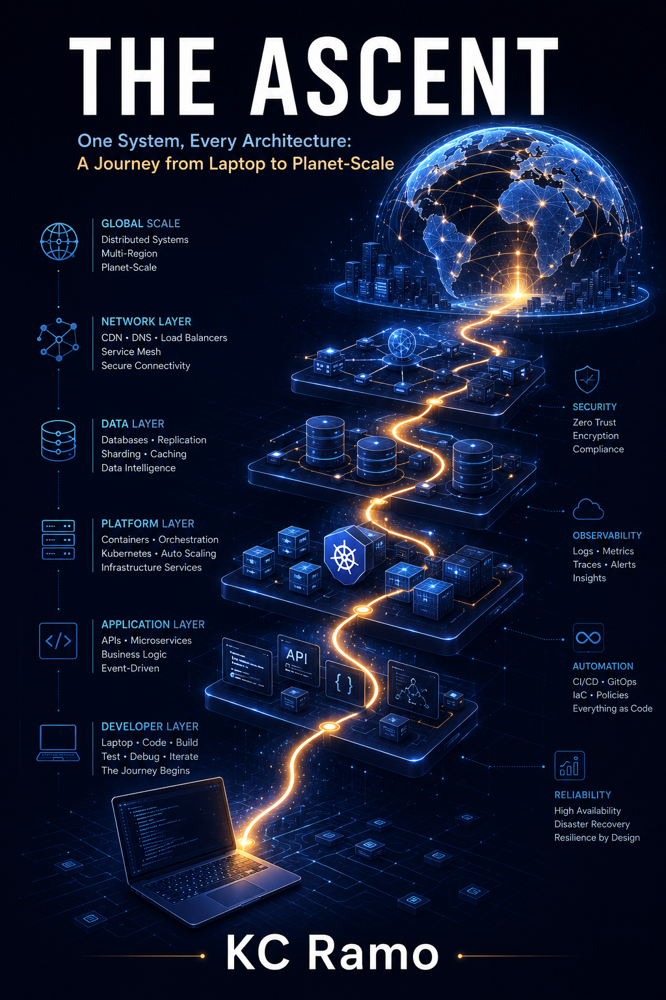

<div align="center">



# Beacon — companion code for *The Ascent*

**One System, Every Architecture: A Journey from Laptop to Planet-Scale**
by **KC Ramo** · Technovize Publishing

[**Get the book →**](https://djangozen.com/ebooks/book/the-ascent/)

</div>

---

## About the book

Every system that serves a billion requests began as a single process on a laptop.

*The Ascent* follows one application — **Beacon**, a collaborative knowledge platform — from a single Django process on a developer's machine all the way to a planetary-scale distributed system serving millions of users across six continents. Sixteen chapters, one continuous story: each chapter introduces a single scaling crisis, explains why it happened, and shows how to solve it, with real code and explicit trade-offs.

The monolith. The cache. The read replica. The shard. The service boundary. The message bus. Real-time collaboration. Search across a billion documents. Multi-region failover. And, at the end, the cost of all of it.

This repository holds the code. The reasoning is in the book.

**[Buy The Ascent →](https://djangozen.com/ebooks/book/the-ascent/)** · 331 pages · PDF + EPUB

---

## What's in here

Each directory is Beacon as it stood at the **end** of that chapter — a complete, runnable Django project, not a fragment.

| Chapter | Directory | What it adds |
|---|---|---|
| 1 | [`chapter-01`](chapter-01) | Django + SQLite — the MVP |
| 2 | [`chapter-02`](chapter-02) | PostgreSQL, pgBouncer, profiling |
| 3 | [`chapter-03`](chapter-03) | Redis, cache-aside, invalidation |
| 4 | [`chapter-04`](chapter-04) | Celery, background tasks |
| 5 | [`chapter-05`](chapter-05) | Read replicas, database routers |
| 6 | [`chapter-06`](chapter-06) | Sharding: consistent hashing, etcd |
| 7 | [`chapter-07`](chapter-07) | DRF, gRPC, Protobuf, Docker Compose |
| 8 | [`chapter-08`](chapter-08) | Outbox pattern, Kafka, Debezium |
| 9 | [`chapter-09`](chapter-09) | Django Channels, WebSockets, CRDT |
| 10 | [`chapter-10`](chapter-10) | Inverted index, Elasticsearch |
| 11 | [`chapter-11`](chapter-11) | Feed fan-out, Redis sorted sets, PyFlink |
| 12 | [`chapter-12`](chapter-12) | ClickHouse, Iceberg, dbt, CDC |
| 13 | [`chapter-13`](chapter-13) | Kubernetes, Istio, CockroachDB |
| 14 | [`chapter-14`](chapter-14) | OpenTelemetry, Prometheus, Grafana |
| 15 | [`chapter-15`](chapter-15) | Terraform, S3, CDN, cost model |
| 16 | [`chapter-16`](chapter-16) | The final state |

### This is not a polished tutorial repo

It is the codebase *as it evolved* — warts, migrations and all.

- **Regressions that get fixed later.** Chapter 4 has an N+1 query problem. Chapter 5 fixes it. That is deliberate: seeing the broken version is what makes the fix mean something.
- **Migrations accumulate.** You can trace exactly when a table gained its index.
- **Infrastructure grows.** One service in Chapter 1; a full topology by Chapter 13.

Diffing two chapters against each other is as instructive as reading either one.

---

## Running the code

Every chapter is self-contained.

```bash
git clone https://github.com/DjangoZenDev/beacon.git
cd beacon/chapter-01
python -m venv beacon_env
source beacon_env/bin/activate      # Windows: beacon_env\Scripts\activate
pip install -r requirements.txt
python manage.py migrate
python manage.py runserver
```

Visit `http://localhost:8000`.

From Chapter 7 onward Beacon is a multi-service system, so those chapters ship a `docker-compose.yml`:

```bash
cd beacon/chapter-13
docker compose up -d
```

Chapter 13 brings up Django, PostgreSQL, Redis, Kafka, Elasticsearch, ClickHouse, etcd and the Istio control plane. Budget 6–8 GB of RAM.

### Requirements

| Component | Minimum | Needed from |
|---|---|---|
| Python | 3.12+ | Chapter 1 |
| Docker | 24.0+ | Chapter 6 |
| Docker Compose | v2.20+ | Chapter 7 |
| kubectl | 1.28+ | Chapter 13 |
| Terraform | 1.6+ | Chapter 15 |

Chapters 1–5 need only Python and a local PostgreSQL.

---

## License

See [LICENSE](LICENSE).

---

<div align="center">

**[The Ascent](https://djangozen.com/ebooks/book/the-ascent/)** — 331 pages on how systems actually grow.
Published by [Technovize](https://technovize.com) · More books and tools at [djangozen.com](https://djangozen.com)

</div>
